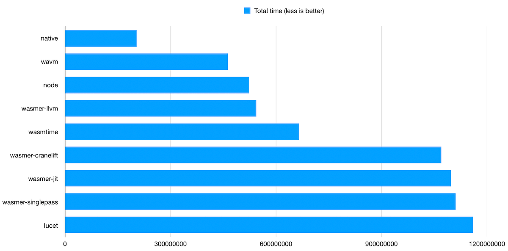
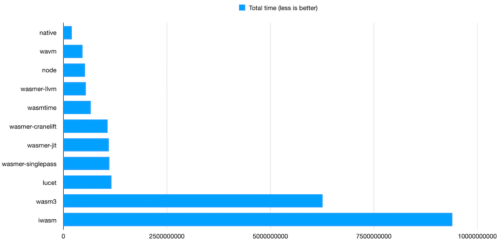
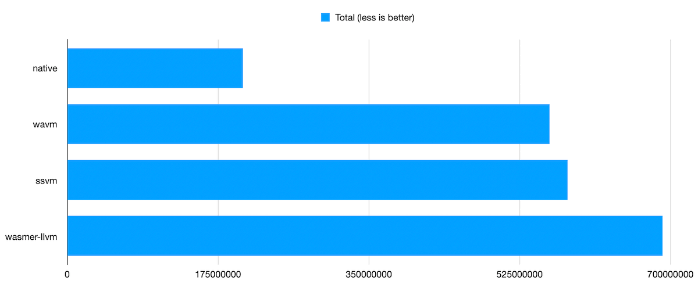

# Benchmark of WebAssembly runtimes - 2021 Q1 edition

Libsodium has been fully supporting WebAssembly as a target for quite a long time. This includes its built-in benchmark suite, that can run both [in web browsers](https://download.libsodium.org/libsodium.js/browsers-test/) and in a variety of standalone WebAssembly runtimes.

The benchmark covers different types of cryptographic primitives. Some are purely computational tasks, some are memory-hard, some require efficient register allocation, some require optimal instruction scheduling, some can greatly benefit from vectorization, some don't benefit from vectorization at all. It also includes utility functions such as codecs.

At the end of the day, this benchmark may not be a bad representative of how different compilers would optimized real-world code. It can also help quantify the overhead of WebAssembly vs native code.

For the third time, WebAssembly runtimes were compared using this benchmark.

## State of the WebAssembly runtimes in 2021

There are quite a lot of WebAssembly runtimes around. However, in early 2021, most of them are still in early stage, have been abandoned, or don't support the full specification or WASI.

That can be easily explained. WebAssembly as a byte code and a memory model specification looks really simple and fun to implement, akin to writing a toy VM for a corewar game.

This is actually how it originally looked. Since then, WebAssembly evolved, and keeps evolving to become a full-fledged platform. Implementing a WebAssembly runtime has become significantly more complicated and time-consuming. Runtimes such as [EOS](https://github.com/EOSIO/eos) kept the bytecode and chose to build their own ecosystem.

Meanwhile, ton of improvements were made by already well-established runtimes in the past few months. A good opportunity to run a new round of the libsodium benchmarks to see if major performance changes can be observed.

Older versions of the following runtimes had been tested in the previous rounds:

* [wasmer](https://wasmer.io)
* [wasmtime](https://wasmtime.dev)
* [lucet](https://github.com/bytecodealliance/lucet)
* [WAVM](https://wavm.github.io)

Additional runtimes for that round:

* [Second State VM](https://www.secondstate.io) (with some caveats)
* [V8](https://v8.dev) [(nodeJS)](https://nodejs.org)
* [Intel WAMR](https://github.com/bytecodealliance/wasm-micro-runtime) ("fast interpreter" mode)
* [wasm3](https://github.com/wasm3/wasm3)

The following runtimes were considered but couldn't be used to run the benchmark:

* [InNative](https://github.com/innative-sdk/innative): no WASI support
* [fizzly](https://github.com/wasmx/fizzy): failed with `imported function wasi_snapshot_preview1.poll_oneoff is required`

All of these were compiled from their git code on 02/21/2021, in release mode, with the exception of NodeJS, that was installed using the stock precompiled packages. Latest stable Rust, latest Xcode, everything was up-to-date.

All the benchmarks are included in [libsodium 1.0.18-stable](https://libsodium.org) released on 02/21/2021, and were run using the `./dist/wasm32-wasi.sh --bench` command. The system compiler was LLVM 11.1.0, installed via Homebrew, and the output was automatically pre-optimized by the previous script with `wasm-opt -O4`. The exact same resulting WASM files were used with all the runtimes, on macOS and Linux. Individual runtimes were called by [that script](https://github.com/jedisct1/libsodium/blob/master/test/default/wasi-test-wrapper.sh).

In order for the comparison between WebAssembly and native code to remain fair and representative of real-world performance, WebAssembly and native builds were compiled with the same, default optimization flags.

## Compilers (JIT & AOT)



Good news: all the tests passed flawlessly on all runtimes. Previously, the same benchmark triggered bugs in some implementations, that have been fixed since.

`WAVM` remains the fastest WebAssembly runtime, beating the competition in every single test.

`WAVM` is based on `LLVM`. Intuitively, we may expect the `LLVM` backend of `wasmer` to perform pretty much the same, but `WAVM` was still about 15% faster than `wasmer`.

`V8` (`nodejs`) being the second top performer was quite of a surprise. `WAVM` and `wasmer-llvm` compile everything ahead of time, taking the time to apply as many optimizations as they can. `V8` has two WebAssembly compilers: `LiftOff`, a single-pass compiler, and `TurboFan`, a massively parallel compiler that applies more aggressive optimizations. The combination provides instant start-up. Then, optimal speed is not going to be reached immediately, but I didn't expect `TurboFan` to be that good after it kicks in.

Previous V8 libsodium benchmarks relied on `wasmer-js`, but as Node now includes an experimental WASI implementation, this is what was used here.

`wasmer` with the `singlepass` backend also did really well here. It performing almost as well as the JIT backend was unexpected, and I ran these benchmarks twice to make sure that I didn't get something wrong. A look at individual tests shows the same pattern for each of them, with two minor exceptions. `singlepass` is also very fast to compile.

Another surprise is `wasmtime` performance. Remember that it uses [`cranelift`](https://github.com/bytecodealliance/wasmtime/tree/main/cranelift), a very young code generator, written from scratch. Its performance is already not far from LLVM-based runtimes, which is a very impressive achievement.

`lucet` is the slowest WebAssembly runtime. But in the previous rounds, it was neck-to-neck with `wasmtime`.

So, what happened? `lucet`'s performance likely didn't change. What is more likely to have happened is that `wasmtime` got a brutal speed boost after switching to the latest `cranelift` version and the new backends it comes with. `lucet` and `wasmer-cranelift` are bound to see the same performance boost once they also upgrade their `cranelift` dependency.

Trying to confirm that theory, I updated the `cranelift` dependency to the `0.23.0` version, and enabled the `new-x64-backend` feature flag to use the new backend. It didn't make any significant difference, so there has to be something else that `wasmtime` does and that `lucet` and `wasmer` don't.

## Interpreters



Among the existing WebAssembly interpreters, two of them have good performance and WASI support: `wasm3` and `wamr` (Intel's micro-runtime).

`wasm3` is a really great piece of code. It is just a bunch of small, portable, zero-dependencies C code, that can easily be embedded into any project, including iOS applications. It can also itself be compiled to WebAssembly, [which is pretty cool](https://webassembly.sh/?run-command=wasm3). System requirements: ~64Kb for code and ~10Kb RAM. This is ridiculously low, making `wasm3` a decent choice for constrained environments. I also found it to be very convenient for debugging WebAssembly linking issues.

`wamr` aka `iwasm` is another small runtime, developed by Intel. It is slightly more complicated to use, as it requires a specific toolchain to be compiled and has various features that can be chosen at compile-time. It can also leverage LLVM to provide JIT and AOT capabilities, which is a little bit disturbing and probably not why you would use such a project for.
However, it just got a "fast interpreter", so I had to give it a spin.

So, where are we?

Native code is about 30 times faster than `wasm3`. Let's face it: this is quite good! We're talking about an interpreter here. Versus native code highly optimized for a target CPU. And a WebAssembly transform in the way, requiring the interpreter to do bound checking everywhere.

`wamr` was slower than `wasm3` on every single test. Native code is about 46 times faster. Which remains decent for an interpreter.

## Battle of the LLVMs

`SSVM` (Second State VM) is an LLVM-based runtime focused on performance. It comes as two separate applications: a compiler, that generates a native shared library, and a runtime, that loads a library precompiled with the former tool. Like `wasmer`, it can insert "gas counting" operations, which is useful for smart contracts.

Unfortunately, SSVM only supports Linux/x86_64. So, I couldn't run it on my laptop along with the other tests. I thus conducted another set of benchmarks, on a Linux/x86_64 machine, to compare LLVM-based runtimes.



Although `wasmer`'s LLVM backend is consistently faster than other LLVM-based runtimes, the resulting code is not the fastest.

`wavm` remains undethroned, but `SSVM` comes really close.

Unfortunately, there's a catch. 5 of the tests crashed on `SSVM` with the following message:

```text
ERROR [default] execution failed: unreachable, Code: 0x89
```

Understandably, `SSVM` is still a young project, so it may not be very stable yet.

## ARM CPUs

The previous benchmarks were done on machines with an Intel CPU. But with ARM CPUs being omnipresent on mobile devices, and gaining a lot of traction on servers and laptops, I had to run quick benchmarks on an ARM-based CPU, too.

Libsodium (especially `1.0.18-stable`) doesn't have optimized code for ARM CPUs, so native code has little to no advantage over a WebAssembly equivalent.

This time, I used prepackaged software.

`WAVM` supports `aarch64` CPUs, but doesn't provide pre-compiled binaries, and compiling LLVM on my router would take forever. So, I had to pass on it for now.

`lucet` only supports `x86_64`, so, not an option either.

That leaves us with `wasmtime`, `wasmer`, `node`, and interpreters.

The `llvm` backend of `wasmer` failed with:

```text
1: module instantiation failed (engine: jit, compiler: llvm)
2: Compilation error: unknown ELF relocation 283
```

`native`/`jit` didn't work any better:

```text
Compilation error: Architecture aarch64 not supported
```

`singlepass` maybe? Nope:

```text
The `singlepass` compiler is not included in this binary.
```

The binary was installed via the `curl` command indicated on the project's home page. Sorry Wasmer, but I have to give up at that point. So, only the `cranelift` backend could be tested.


On this platform, with benchmarks not having platform-specific optimizations, `wasmtime` runs the test suite at ~54% the speed of native code. Not bad at all! 

Node is a little bit behind, running at around 49% the speed of native code.

Even with the same backend, `wasmer` is behind `wasmtime`, even on `aarch64`. `wasmtime` really got some nice performence improvements recently!

Of course, `wasm3` runs fine on `aarch64`, but at about 3% of native speed.


## Individual results

Individual results can be downloaded [here](https://github.com/jedisct1/webassembly-benchmarks/tree/master/2021-Q1/output). With minor exceptions, runtimes ranked the same in every test. The WebAssembly files used for these benchmarks can also be downloaded [here](https://github.com/jedisct1/webassembly-benchmarks/tree/master/2021-Q1/wasm). They all print their own execution time, excluding initialization.

## Verdict

These new results are interesting. Amazing work has been done by all runtimes in the past few months, both to implement new features and to improve performance.

If you are looking for a general recommendation for running WebAssembly code in a headless environment, here we go:

-> Just use Node.

Not exactly what I was expecting. But Node is probably a good answer for most people. V8 has become a really damn good engine to run WebAssembly code, Node has a working WASI implementation, so there is absolutely nothing wrong with using Node, even just to run a pure WebAssembly application.

This is a boring and conservative choice. But it does the job. Node has the advantage of being already available in most operating systems/linux distros. Instant integration with JavaScript is also a big plus. And you'll be only one step away from also running your code in a web browser or Electron, with comparable performance.

This advice may come a bit premature, though. As of today, WASI support in Node still has the "experimental" tag. But it's there, and it works. It may not be the most memory-efficient solution, though. So, if this is a concern, you may want to look at alternatives.

Are you looking for the best possible performance to build a "serverless" infrastructure? `WAVM` may be better a choice, combined with "snapshots" of the linear memory made after initialization, as done in the excellent [FAASM](https://github.com/faasm/faasm).

For untrusted applications, and if you are into Rust, you may want to consider `lucet` and its unique ability to stop/resume/reschedule execution.

Are you looking for a one-runtime-to-rule-them-all thing for multiple components of your application, written in a variety of programming languages? `wasmer` will probably be the easiest to integrate.

Are you looking for a way to test the latest WebAssembly proposals? Check out `wasmtime`. Ditto if you need to [run WebAssembly modules from Zig](https://github.com/kubkon/wasmtime-zig). `wasmtime` is fast, even on ARM CPUs, although I wish I could test on one of these fancy new Apple M1 machines.

Finally, if you need something simple, lightweight, that works everywhere, `wasm3` is your friend.